# Top 28 Cryptocurrency Exchange Platforms in 2025 (Latest Updated)

Finding the right place to buy, sell, and trade digital currencies can transform your entire investment experience, whether you're purchasing your first Bitcoin or managing a diversified crypto portfolio across multiple blockchains. The platform you choose determines everything from transaction costs and asset selection to security standards and interface simplicity, making this decision critical for both newcomers entering the market and experienced traders executing complex strategies.

This curated collection ranks 28 leading cryptocurrency exchange platforms based on comprehensive value metrics including fee structures, supported assets, security infrastructure, regulatory compliance, and user experience quality. Each platform serves specific trading needs, from beginner-friendly interfaces with educational resources to advanced order types with institutional-grade tools and deep liquidity pools.

---

## **[Coinbase](https://coinbase.com)**

The most trusted entry point for mainstream cryptocurrency adoption, serving over 100 million users worldwide with regulatory compliance and beginner-focused design.

Founded in 2012, this San Francisco-based platform has become synonymous with accessible crypto trading through its intuitive interface that makes buying Bitcoin and Ethereum as straightforward as traditional online banking. The exchange splits its experience into Simple Trade for one-tap purchases and Advanced Trade with order books, TradingView-style charting, and maker/taker fees starting at 0.40% maker and 0.60% taker that decrease with volume.

**Security and custody approach:** USD balances receive FDIC insurance coverage up to $250,000 through partner banks, while cryptocurrency holdings remain in custodial storage with crime insurance for certain hot-wallet risks. Users can transfer assets to the self-custody Coinbase Wallet for on-chain DApp access and full private key control.

The platform supports over 240 digital assets with deep liquidity on major pairs during U.S. trading hours, particularly for BTC/ETH/USDC combinations. Integration includes staking rewards for Proof-of-Stake cryptocurrencies, educational programs through Coinbase Learn that reward users with free crypto, and a Visa debit card with crypto cashback rewards.

Regulatory positioning remains strongest among U.S.-based exchanges, operating under state money transmitter licenses and maintaining transparent proof-of-reserves reporting. The 2025 account restriction improvements roadmap focuses on making the platform easier to use while enhancing security measures after addressing previous data incidents.

Advanced traders benefit from limit orders, stop-loss functionality, and API access for algorithmic strategies, though fees remain higher than volume-discount competitors at 0.50% to 4.00% depending on payment methods. The Coinbase One subscription eliminates trading fees entirely for spot trades while providing priority support and boosted staking rewards.

***

## **[Kraken](https://kraken.com)**

Distinguished by industry-leading low fees and spotless 13-year security track record, targeting cost-conscious traders who demand institutional-grade protection.

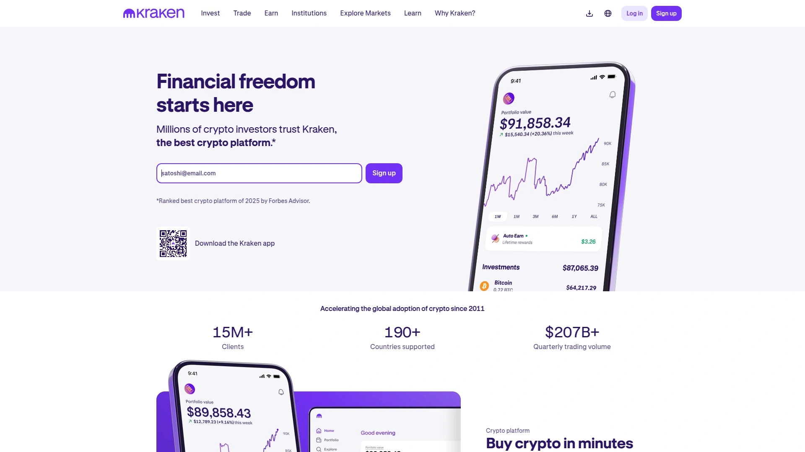

This platform offers some of the most competitive pricing structures available, with maker fees starting at 0.16% and scaling down to 0% for high-volume participants. The exchange maintains 95% of customer funds in cold storage and publishes regular proof-of-reserves audits, demonstrating transparency about asset protection that few competitors match.

Traders access advanced order types including stop-loss orders, margin trading with up to 5x leverage, and futures contracts through professional-grade charting tools. The platform supports over 200 cryptocurrencies with deep liquidity across major trading pairs, making it suitable for both retail and institutional execution strategies.

Founded in 2011 and headquartered in San Francisco, Kraken has operated without suffering a major security breach throughout its entire history. The exchange serves users in over 190 countries with some regional restrictions, offering ACH transfers and multiple fiat on-ramps for convenient funding.

The interface provides both standard and Kraken Pro versions, with the Pro platform delivering the lowest fee structures for active traders. New users receive a $25 USDG bonus after completing their first $100 trade, adding value for beginners exploring the platform's capabilities.

***

## **[Binance.US](https://binance.us)**

Widest selection of tradable digital assets with 180+ cryptocurrencies and zero-fee trading on select pairs for maximum portfolio diversification.

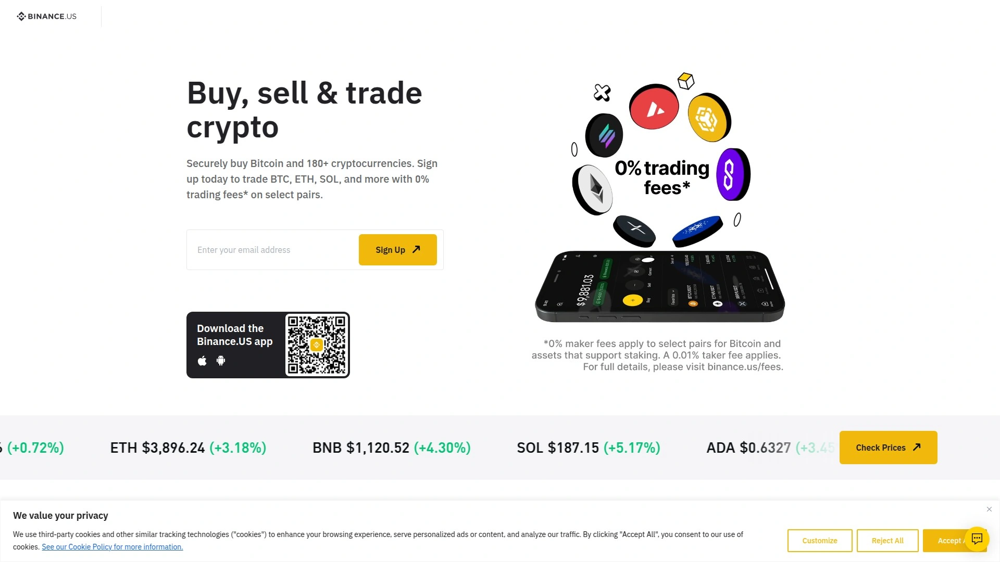

The platform stands out for its extensive asset coverage, providing access to emerging tokens and altcoins unavailable on mainstream exchanges. Staking rewards programs cover 20+ Proof-of-Stake cryptocurrencies, enabling passive income generation for long-term holders.

Trading fees remain competitive with maker/taker structures starting at 0.10% for both sides and decreasing based on 30-day volume tiers. Select trading pairs carry 0% fees, significantly reducing costs for high-frequency strategies.

The separate U.S. entity operates under domestic regulatory frameworks while maintaining connection to Binance's global liquidity pools. Users benefit from sophisticated trading tools including spot markets, futures contracts, and options products.

Mobile applications for iOS and Android provide full trading functionality with real-time price alerts and portfolio tracking. The platform integrates educational resources and market analysis tools to support informed decision-making across its vast asset selection.

***

## **[Gemini](https://gemini.com)**

Built on security-first principles and regulatory compliance under New York's strict BitLicense framework for institutional-grade asset protection.

Founded by the Winklevoss twins, this New York-based exchange operates as a trust company regulated by the New York State Department of Financial Services. The platform attracts experienced traders who prioritize data security and transparent regulatory oversight.

Trading fees structure starts at 0.25% for both makers and takers, decreasing to 0.10% maker and 0.35% taker based on monthly volume. The platform supports over 70 cryptocurrencies including major assets like Bitcoin, Ethereum, Solana, and Polkadot.

**Custody and insurance:** Assets remain in cold storage with comprehensive insurance coverage exceeding industry standards. The exchange implements biometric authentication, hardware security modules, and continuous security monitoring.

Gemini serves all 50 U.S. states and territories plus over 60 countries globally, offering ACH transfers, PayPal integration, and Apple Pay support for seamless funding. The platform provides both basic and ActiveTrader interfaces, with the advanced version delivering lower fees and professional charting.

Automated purchase features enable dollar-cost averaging strategies, while staking services generate passive returns on eligible cryptocurrencies. The Gemini Earn program historically offered interest on crypto holdings, though users should verify current availability and terms.

---

## **[Crypto.com](https://crypto.com)**

Superior mobile trading experience with highly rated apps, Visa card integration, and extensive rewards program for daily crypto spending.

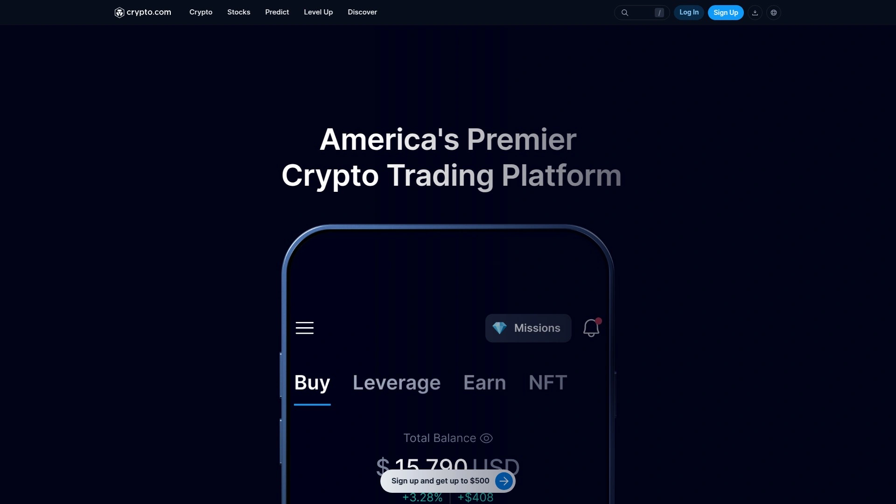

Headquartered in Singapore and serving over 100 million users across 90+ countries, this platform excels in mobile-first design that makes trading seamless on smartphones. The application provides access to more than 400 cryptocurrencies with sophisticated features typically found only on desktop platforms.

The Crypto.com Visa Card stands out as a primary differentiator, allowing users to spend cryptocurrency anywhere Visa is accepted while earning crypto cashback on purchases. No annual fee applies, and the card supports multiple digital assets with instant crypto-to-fiat conversion at point of sale.

Trading fees operate on a tiered structure with maker fees ranging from 0.04% to 0.10% and taker fees from 0.10% to 0.16%, varying based on trading volume and user status. The platform supports Bitcoin options and futures for derivative traders seeking leveraged exposure.

Earn and staking programs provide multiple paths to passive income, with competitive rates on major cryptocurrencies. Automated trading features allow users to program their strategies and execute trades without manual intervention.

Security infrastructure includes cold storage for majority of assets, two-factor authentication, biometric login options, and continuous monitoring. The platform maintains reasonable fee structures alongside its extensive cryptocurrency selection.

***

## **[KuCoin](https://kucoin.com)**

Premier destination for accessing new and niche altcoins with over 700 cryptocurrencies unavailable on mainstream platforms.

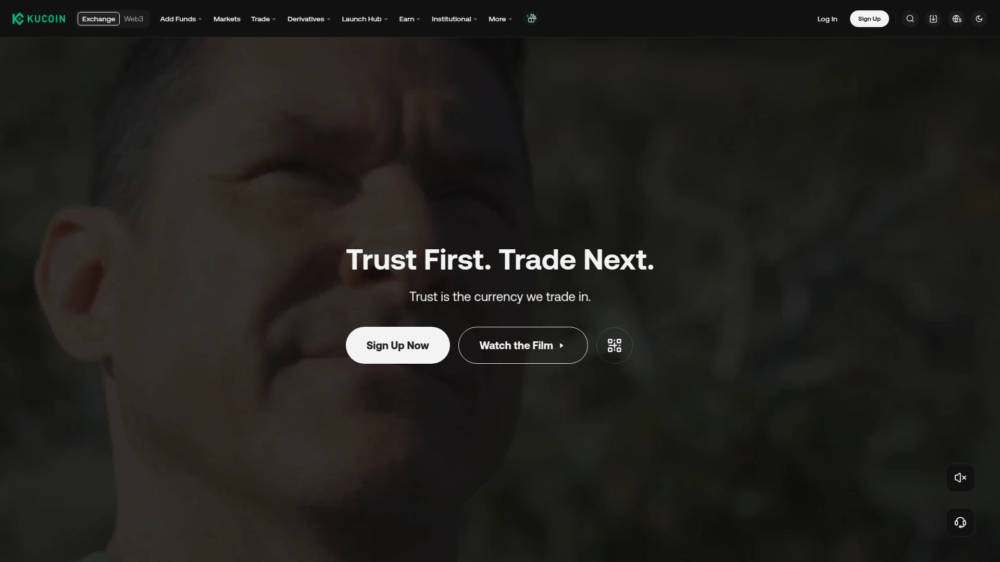

Established in 2017 with headquarters in Seychelles, KuCoin has built its reputation as the number one altcoin exchange through sheer volume of available assets. The platform provides early access to emerging projects and tokens before they reach larger exchanges.

Trading fees remain highly competitive with structures starting at 0.10% for both makers and takers, scaling down to 0.01% maker and 0.07% taker based on 30-day trading volume. Volume-based discounts make this platform cost-effective for active traders.

**Advanced trading capabilities:** The platform offers margin trading, futures contracts, and technical analysis tools that experienced traders appreciate. Mobile applications for iOS and Android enable portfolio management and trading from anywhere.

KuCoin recovered from a 2020 security incident by implementing enhanced protection protocols and maintaining comprehensive insurance coverage. The exchange stores majority of user funds in cold wallets with multi-signature requirements.

The interface may initially appear complex for beginners due to its extensive feature set and wide range of trading pairs. However, this depth provides the flexibility that advanced users require for sophisticated strategies.

Staking services, liquidity mining, and lending programs offer multiple revenue streams beyond basic trading. Users should verify regulatory compliance in their jurisdiction as KuCoin is not licensed in all regions including the United States.

---

## **[Gate.io](https://gate.io)**

Comprehensive trading ecosystem with extensive trading pairs, margin trading, staking services, and cryptocurrency loans for diverse needs.

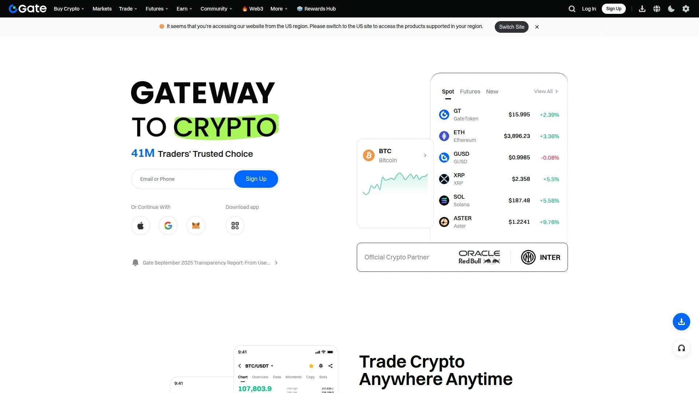

This platform distinguishes itself through a simple and intuitive interface combined with a vast selection of cryptocurrency assets and trading pairs. Founded with a focus on serving both retail and institutional clients, Gate.io provides access to over 400 cryptocurrencies.

Fee structures operate on a volume-based tier system with maker fees ranging from 0.20% to 0.02% and taker fees from 0.20% to 0.07%. Higher trading volumes unlock progressively lower rates, rewarding active participants.

**Additional services expand beyond spot trading:** Margin trading enables leveraged positions, staking generates passive income on eligible assets, and cryptocurrency-backed loans provide liquidity without selling holdings. Good liquidity across major pairs ensures efficient order execution.

The platform maintains strong security protocols including cold storage, multi-signature wallets, and regular security audits. User support responds to inquiries through multiple channels with reasonable response times.

Some users note that fees may run slightly higher than absolute lowest-cost competitors, though the comprehensive service offering often justifies the difference. Certain advanced features may be unavailable in specific countries due to regulatory restrictions.

Mobile applications deliver full trading functionality with real-time price tracking and portfolio management tools. The exchange supports multiple fiat currencies for deposits and withdrawals, improving accessibility for international users.

***

## **[OKX](https://okx.com)**

Multi-chain trading powerhouse offering over 400 cryptocurrency pairs with advanced derivatives, Web3 wallet, and institutional services.

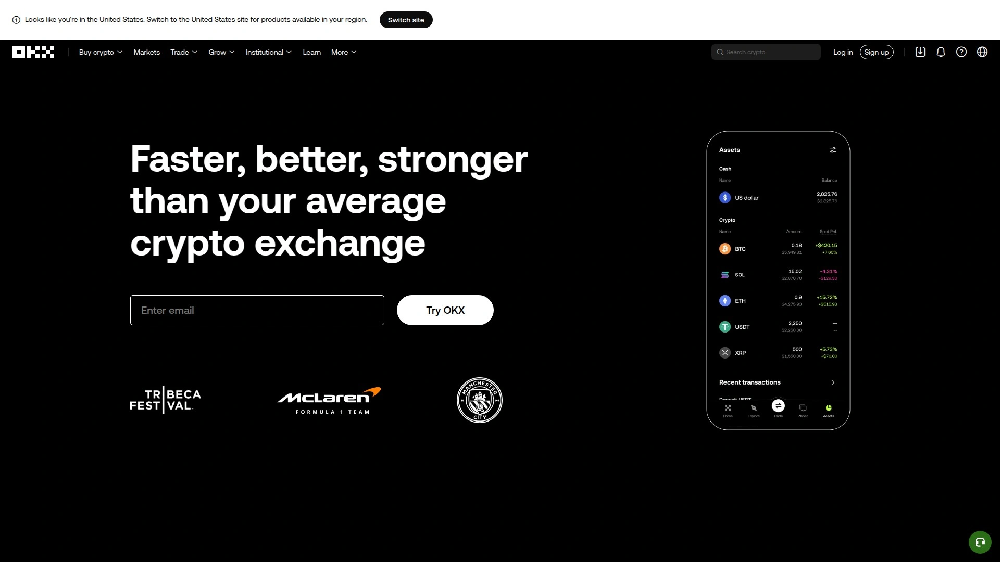

Operating since 2017, OKX has grown into one of the world's largest exchanges by trading volume, providing comprehensive spot and derivatives markets. The platform serves both retail traders and institutional clients with sophisticated tools and deep liquidity pools.

Trading fees follow a volume-tiered structure with maker fees ranging from 0.10% to 0.06% and taker fees from 0.15% to 0.10%. Specific fee schedules vary based on trading volume, with detailed information available on the exchange website.

The integrated Web3 wallet connects users to decentralized applications, NFT marketplaces, and cross-chain bridges while maintaining self-custody of assets. This positions OKX as a gateway between centralized and decentralized finance.

**Derivatives capabilities:** The platform offers perpetual swaps, futures contracts, options products, and margin trading with various leverage levels. Professional traders access advanced order types including trailing stops, iceberg orders, and time-weighted average price execution.

Security measures include cold storage for majority of funds, multi-signature technology, and insurance coverage. The exchange publishes proof-of-reserves to demonstrate asset backing.

OKX maintains availability in numerous countries while adhering to local regulatory requirements. Users should verify service availability and compliance in their specific jurisdiction.

***

## **[Bybit](https://bybit.com)**

High-performance derivatives exchange featuring negative maker fees, 75% taker rate, and specialized leverage trading infrastructure.

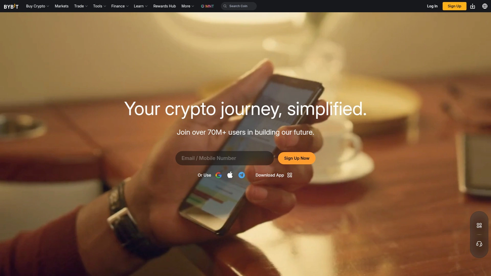

Founded as a derivatives-focused platform, Bybit has expanded to offer comprehensive spot markets while maintaining its reputation for sophisticated futures and perpetual swap trading. The platform serves experienced traders seeking professional-grade tools and execution quality.

**Innovative fee structure:** Makers receive a -0.025% rebate, effectively earning money for providing liquidity, while takers pay 0.075%. This incentivizes market-making strategies and rewards traders who add depth to order books.

The platform supports Bitcoin, Ethereum, EOS, Ripple, and numerous other major cryptocurrencies across spot and derivatives markets. Leverage options extend up to 100x on select contracts, though such high leverage carries significant risk.

Bybit emphasizes security through cold wallet storage, multi-tier wallet architecture, and regular security audits. The exchange maintains insurance funds to protect against extreme market volatility and unexpected losses.

Trading interface provides real-time market data, advanced charting tools, and customizable layouts for monitoring multiple markets simultaneously. Mobile applications deliver full functionality for traders who need flexibility.

The platform has gained traction among cryptocurrency derivatives traders, currently holding top positions in futures trading volume. Users appreciate the combination of competitive fees, deep liquidity, and responsive customer support.

***

## **[Bitfinex](https://bitfinex.com)**

Longest-running major cryptocurrency exchange since 2012, delivering institutional-grade liquidity and sophisticated trading tools for professionals.

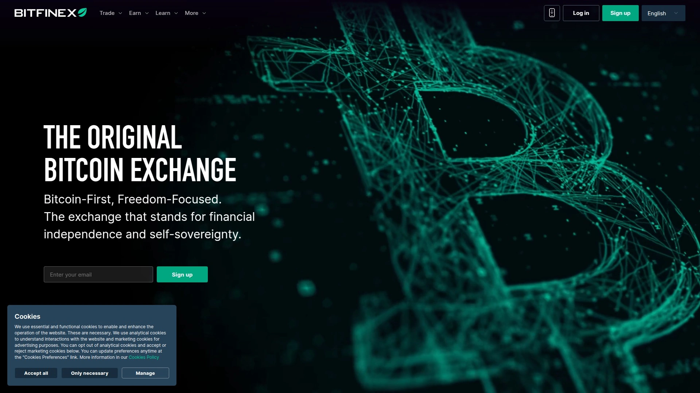

As one of the industry's pioneering platforms, Bitfinex has maintained its position as the go-to destination for serious traders and institutional participants. The exchange provides access to extensive cryptocurrency pairs with professional-grade order types and execution capabilities.

The platform specializes in serving experienced traders who require advanced features including margin trading, lending markets, and OTC trading desks for large orders. Liquidity depth on major pairs enables efficient execution even for substantial position sizes.

**Security and compliance:** Bitfinex implements multi-signature cold storage, hardware security modules, and continuous monitoring systems. The exchange operates through a licensed entity and maintains regulatory compliance in its jurisdictions.

Trading fees vary based on volume and order type, with maker/taker structures that reward high-volume participants. The platform supports both cryptocurrency-only and fiat-integrated trading depending on user verification level.

Users access professional charting tools, API connectivity for algorithmic trading, and margin lending markets where they can earn interest by providing funding to leveraged traders. The interface caters to experienced participants rather than beginners.

Mobile applications provide full access to trading features, account management, and real-time market data. The platform maintains a proven track record of handling high-volatility periods with stable infrastructure.

***

## **[Bitstamp](https://bitstamp.com)**

First licensed cryptocurrency exchange in the EU, offering established regulatory framework and institutional-grade reliability since 2011.

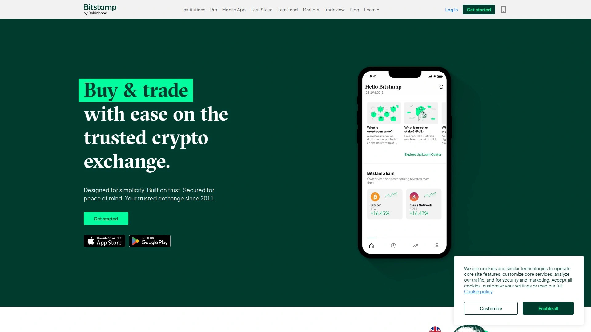

Operating under European Union financial regulations, Bitstamp holds the distinction of being the first crypto exchange to receive official licensing. Verification typically completes within hours requiring ID upload and proof of residence.

The platform serves users seeking regulatory certainty and established operational history, having processed billions in trading volume over its 14-year existence. Robinhood acquired Bitstamp in July 2024 for approximately $200 million, adding institutional backing.

Trading fees operate on a tiered structure with maker fees ranging from 0.50% to 0.10% and taker fees from 0.50% to 0.20% based on 30-day trading volume. While not the absolute lowest in the industry, fees reflect the exchange's emphasis on security and compliance.

**Asset coverage and features:** The platform supports Bitcoin, Ethereum, Ripple, and other major cryptocurrencies with reliable fiat on-ramps. Mobile applications enable trading and account management on iOS and Android devices.

Bitstamp implements proof-of-reserves, cold storage for majority of assets, two-factor authentication, and comprehensive insurance coverage. The licensed and regulated status provides additional confidence for risk-conscious traders.

The interface maintains simplicity and ease of use, making it accessible for beginners while providing sufficient tools for experienced traders. Customer support receives positive ratings for responsiveness and helpfulness.

***

## **[MEXC](https://mexc.com)**

Specialized in new projects and lesser-known cryptocurrencies, offering over 300 trading pairs with innovative features like auctions and staking.

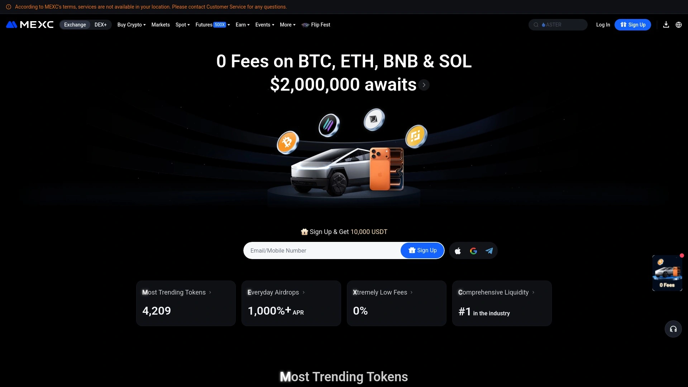

MEXC distinguishes itself through active support for emerging blockchain projects and early-stage tokens, providing access to cryptocurrencies before they reach mainstream exchanges. The platform regularly adds new assets and hosts token launch events.

Trading fees follow a volume-based structure with maker fees ranging from 0.20% to 0.05% and taker fees also from 0.20% to 0.05%. Fee schedules vary based on 30-day trading volume, with details available on the exchange website.

**Innovative offerings:** The platform hosts initial exchange offerings, token auctions, and launchpad events that give users early access to new projects. Staking programs provide passive income opportunities across numerous cryptocurrencies.

User support receives excellent ratings for responsiveness and problem resolution. The exchange maintains active community engagement through social media and customer service channels.

Some trading pairs may experience liquidity issues, particularly for newly listed or less popular tokens. Traders should verify order book depth before executing large positions.

The interface may appear somewhat complex for complete beginners due to the extensive range of features and trading pairs. However, this depth appeals to experienced traders seeking access to emerging opportunities.

***

## **[BingX](https://bingx.com)**

High-liquidity exchange providing extensive trading pairs, derivatives instruments, and copy trading features with security emphasis.

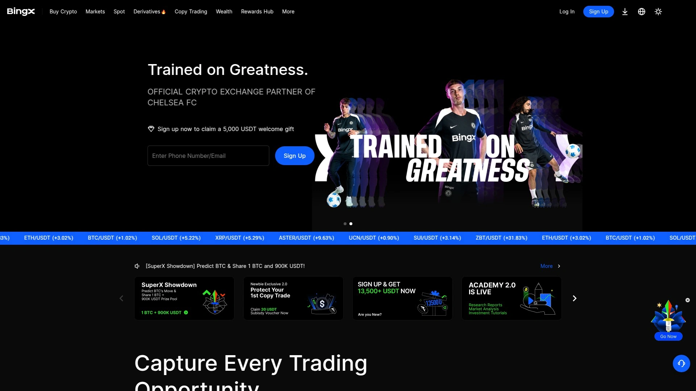

BingX has positioned itself as a reliable platform for traders seeking deep liquidity and a wide range of trading instruments. The exchange supports spot trading, futures contracts, options products, and leverage trading for experienced participants.

**Copy trading functionality:** Users can automatically replicate the trades of successful traders, making sophisticated strategies accessible to those with limited experience. This social trading feature has attracted users who want to learn from professionals while generating returns.

The platform emphasizes security through cold storage, multi-signature wallets, and comprehensive insurance coverage for user funds. Regular security audits and transparent communication about protection measures build user confidence.

Trading fees can run higher than some competitors, with specific rates varying based on order type and trading volume. Users should review the fee schedule for their intended trading patterns.

Not all cryptocurrency assets are available on the platform, with focus maintained on high-quality projects and sufficient liquidity. This selective approach reduces exposure to unreliable tokens.

Mobile applications deliver full trading capabilities with real-time charts, order management, and portfolio tracking. The platform serves international users across numerous countries with appropriate regulatory compliance.

***

## **[Bitget](https://bitget.com)**

Rapidly growing derivatives exchange with 1.6+ million users, featuring one-click copy trading and innovative USDT-margined futures.

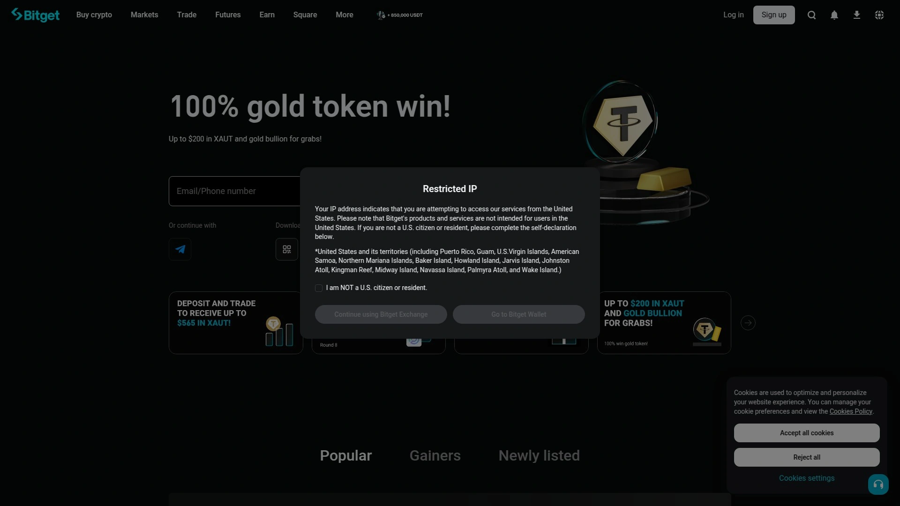

Since launching in July 2018, Bitget has risen to prominence as one of the leading derivatives exchanges globally. The platform's philosophy of trading better drives continuous innovation in products and services.

**Flagship products:** USDT-margined futures provide stable collateral denominated in Tether rather than underlying crypto, one-click copy trading enables beginners to follow expert strategies automatically, and Quanto swap futures offer specialized contract types.

The exchange serves users worldwide with spot trading, futures trading, and digital asset acquisition services. Trading fees vary based on volume and order type, with competitive rates for active participants.

Bitget mobile applications provide full cryptocurrency spot trading capabilities with user-friendly interfaces optimized for mobile devices. The platform also offers customized desktop experiences for Windows and MacOS with professional-grade tools.

A robust API facilitates seamless integration for developers building custom trading applications and algorithmic strategies. The exchange maintains focus on innovation and excellence in the cryptocurrency trading landscape.

Security measures include cold storage, two-factor authentication, and regular platform audits. The exchange has built a reputation for reliable operations and responsive customer support.

***

## **[HTX](https://htx.com)**

Previously known as Huobi, offering spot trading with 5X leverage, multi-signature cold wallets, and 20,000 BTC Security Reserve Fund.

HTX positions itself as a comprehensive cryptocurrency platform with features spanning spot markets, futures trading, and digital asset management. Users can purchase cryptocurrencies using credit cards through partnered payment services for convenient funding.

**Security infrastructure:** Client funds remain in dedicated multi-signature cold wallets with round-the-clock monitoring. The exchange maintains a Security Reserve Fund of 20,000 BTC specifically to enhance client confidence and protect against unexpected events.

Mobile applications for Android and iOS enable users to deposit, withdraw, and trade anytime with full platform functionality. The exchange expanded its services to include HTX Chat for blockchain education and professional multi-crypto wallets.

As a leading global OTC platform, HTX facilitates large trades and institutional transactions with competitive pricing and deep liquidity. The platform serves both retail traders and professional investors with diverse needs.

The exchange operates under a decentralized governance model through HTX DAO, allowing token holders to participate in decision-making processes. This multi-chain foundation ensures cross-chain compatibility and dynamic utility.

Users benefit from trading fee structures that reward volume, staking opportunities for passive income, and access to emerging blockchain projects. The platform continues evolving its offerings to meet changing market demands.

---

## **[eToro](https://etoro.com)**

Multi-asset social trading platform featuring copy trading functionality, regulated operations, and accessible interface for beginners and experienced traders.

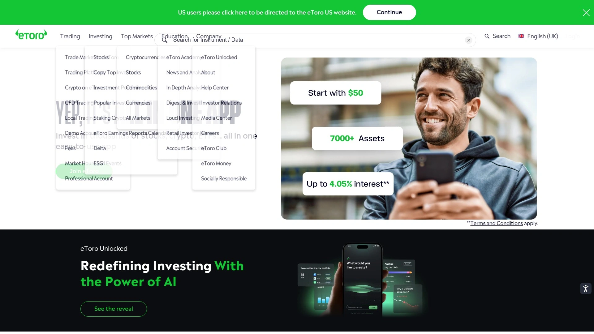

Founded in 2007 in Israel and operating in the U.S. since 2018, eToro has differentiated itself through social trading features that resemble social media platforms. The CopyTrader functionality allows users to automatically replicate trades of successful investors.

The platform supports 3,250 stocks, 270 ETFs, 24 cryptocurrencies, futures, and options products. This multi-asset approach enables portfolio diversification across traditional and digital assets in a single account.

**Regulatory compliance and security:** eToro operates under proper licensing and regulatory oversight in multiple jurisdictions. The platform maintains strong security protocols including two-factor authentication and encrypted communications.

Trading fees include a 1% cryptocurrency trading fee plus market spread, while stock, ETF, and options trading carries no commission in most regions. A 2% fee applies to cryptocurrency asset transfers.

Minimum deposits range from $50-$200 for most regions, with $200 minimum per trader for copy trading features and $500 minimum for portfolio investments. These thresholds make the platform accessible for various budget levels.

The social feed enables interaction with other traders, sharing insights and strategies in a community environment. Educational resources help users understand markets and develop trading skills.

---

## **[Robinhood](https://robinhood.com)**

Commission-free trading platform expanding crypto offerings through Bitstamp acquisition, serving mainstream investors with simple mobile interface.

Originally launched as a stock trading app, Robinhood has grown its cryptocurrency capabilities significantly. The July 2024 acquisition of Luxembourg-based Bitstamp for approximately $200 million strengthened the platform's crypto infrastructure and institutional capabilities.

The platform appeals to beginner investors through its intuitive design that eliminates intimidating complexity. Commission-free trading on stocks, ETFs, and cryptocurrencies removes barriers for small-account holders.

**Asset availability:** Users can trade major cryptocurrencies including Bitcoin, Ethereum, and popular altcoins alongside traditional equities and options. The integration of Bitstamp's technology enhanced liquidity and execution quality.

Mobile-first design provides seamless trading experiences on smartphones with real-time price tracking and instant order execution. The application emphasizes simplicity while providing sufficient tools for effective trading.

Robinhood operates under U.S. financial regulations with appropriate licensing for securities and cryptocurrency trading. The platform serves millions of users who appreciate the straightforward approach to investing.

Fractional share trading enables investment in expensive stocks and cryptocurrencies with small amounts. The platform continues expanding its cryptocurrency offerings and educational resources.

***

## **[Uphold](https://uphold.com)**

Serving 10+ million users with 300+ cryptocurrencies and fiat trading, featuring 100%+ reserve transparency model and seamless asset swaps.

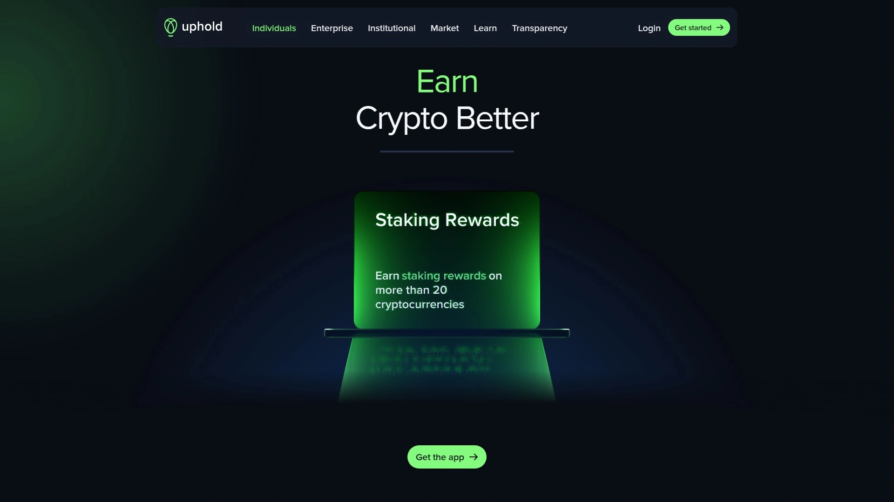

Uphold distinguishes itself through an extensive selection of 300+ cryptocurrencies plus fiat currencies and precious metals, enabling diverse portfolio construction. The platform emphasizes seamless swaps between different asset types without complex processes.

**Transparency and security:** The exchange maintains a 100%+ reserve model, holding assets exceeding customer balances as verified through regular audits. This transparency provides confidence that funds remain fully backed.

Trading fees operate competitively with structures comparable to major exchanges. The platform offers deep liquidity across popular trading pairs for efficient order execution.

Advanced tools include customizable trading interfaces, real-time market data, and comprehensive portfolio analytics. UK users can access an exclusive debit card for spending cryptocurrencies in everyday transactions.

The Uphold Vault feature provides enhanced security for long-term holdings with time-locked withdrawals and additional authentication requirements. This appeals to users prioritizing asset protection over instant liquidity.

Regulated by FinCEN in the United States and holding various licenses internationally, Uphold operates under appropriate oversight in its jurisdictions. The platform serves users across numerous countries with compliant operations.

***

## **[Bittrex](https://bittrex.com)**

Established exchange offering over 250 cryptocurrency pairs with decreasing volume-based fees and comprehensive security measures.

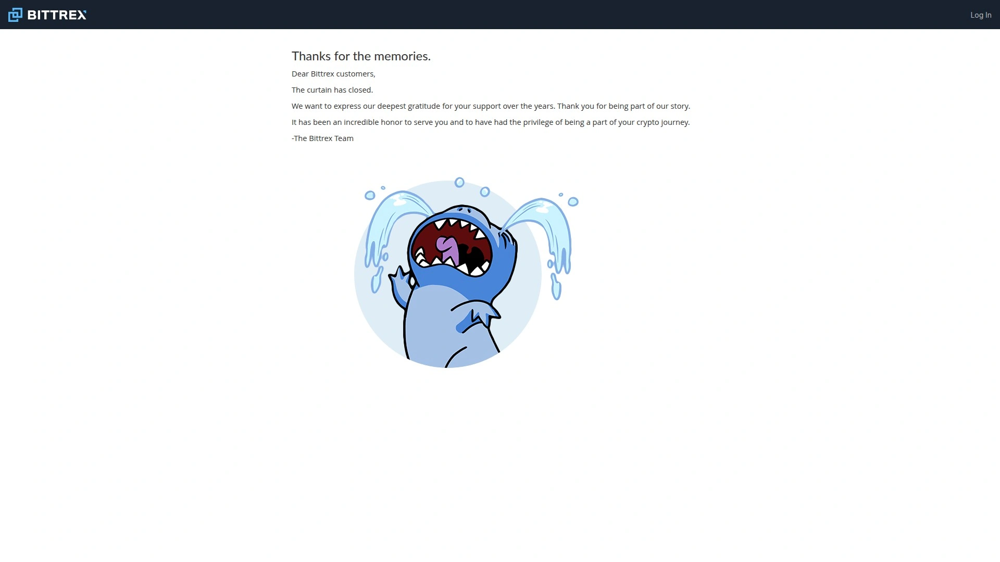

Bittrex provides access to a wide selection of cryptocurrencies beyond mainstream offerings, catering to traders seeking diversified altcoin exposure. The platform serves both U.S. and international users with appropriate regulatory compliance.

Trading fees follow a volume-tiered structure with both maker and taker fees starting at 0.25% and decreasing to 0.20% for higher volume traders. These competitive rates make the platform viable for active trading strategies.

**Security infrastructure:** The exchange implements industry-standard protection including cold storage for majority of funds, two-factor authentication, and IP whitelisting for withdrawals. Regular security audits verify the integrity of systems.

The platform interface provides professional charting tools, multiple order types, and real-time market data for informed decision-making. Advanced traders appreciate the depth of features available.

Mobile applications enable trading on the go with full account functionality and portfolio management tools. The exchange maintains stable uptime and reliable execution even during high-volatility periods.

Customer support responds to inquiries through ticketing systems with reasonable resolution times. The platform publishes educational resources to help users understand cryptocurrency trading and market dynamics.

---

## **[CEX.IO](https://cex.io)**

Global cryptocurrency exchange since 2013 with billions in monthly volume, offering deep liquidity across 300+ vetted markets and institutional services.

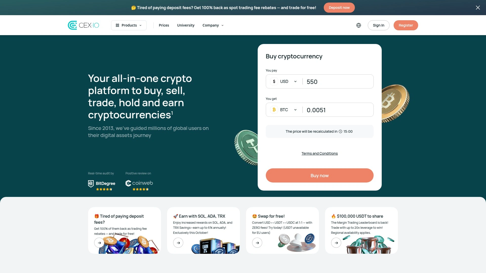

CEX.IO addresses liquidity concerns through deep order books across more than 300 carefully screened markets. The exchange vets assets for demand, on-chain activity, and reliability before listing, helping users avoid thinly traded or questionable tokens.

**Trading volume and reputation:** Processing billions in monthly trading volume since 2013, CEX.IO has established itself as a preferred venue for high-net-worth individuals and institutional clients. This sustained activity provides consistent liquidity for efficient execution.

Fee structures include maker fees ranging from 0.16% to 0.00% and taker fees from 0.25% to 0.10%, decreasing based on 30-day trading volume. The platform maintains competitive pricing while delivering reliable service.

Users can trade cryptocurrencies against fiat currencies with convenient deposit and withdrawal options including bank transfers and credit cards. The exchange also offers staking and lending programs for generating passive income.

CEX.IO operates with a Distributed-ledger provider (DLT) license in Gibraltar, demonstrating regulatory compliance. The platform implements two-factor authentication, cold storage, and comprehensive security protocols.

Mobile applications provide full trading capabilities with user-friendly interfaces suitable for beginners and experienced traders. The exchange serves a global customer base with appropriate regional support.

---

## **[Interactive Brokers](https://interactivebrokers.com)**

Traditional brokerage expanding into cryptocurrency with institutional-grade infrastructure and multi-asset trading capabilities.

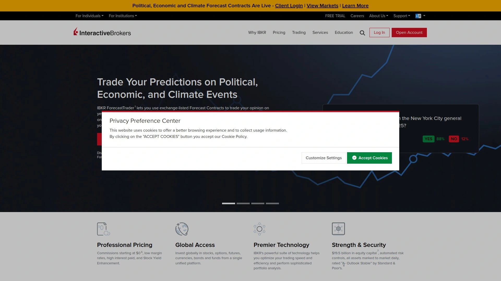

Interactive Brokers brings decades of traditional finance experience to cryptocurrency markets, offering seamless integration between stocks, bonds, options, futures, and digital assets. This multi-asset approach appeals to investors seeking comprehensive portfolio management.

The platform serves serious traders and investors who value institutional-quality execution, competitive pricing, and sophisticated trading tools. Professional-grade charting, research capabilities, and risk management features come standard.

**Regulatory standing and security:** As a long-established regulated broker-dealer, Interactive Brokers maintains oversight from multiple financial authorities. This provides additional confidence compared to crypto-only exchanges.

Cryptocurrency offerings continue expanding as the platform responds to client demand for digital asset exposure. Users benefit from the same quality execution and customer service standards applied to traditional securities.

Fee structures remain competitive with the brokerage's reputation for low-cost trading extending to cryptocurrency markets. The platform targets active traders and institutional participants rather than casual investors.

Advanced account types support portfolio margin, allowing efficient capital utilization across correlated positions. API connectivity enables algorithmic trading and custom application development.

---

## **[Webull](https://webull.com)**

Comprehensive investment platform with commission-free trading, recently separating cryptocurrency operations into dedicated Webull Pay entity.

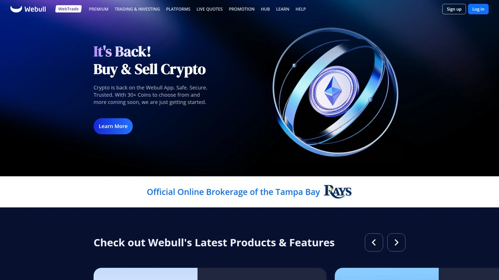

Founded in 2017, Webull offers access to nearly the entire stock and ETF universe plus options, margin investing, and futures. The platform fits beginner investors through intermediate traders with its progression of features.

**Platform capabilities:** Comprehensive trading tools include features for both fundamental analysis and technical charting. The interface balances accessibility for newcomers with depth for developing traders.

Zero commission trading applies to stocks, ETFs, and options, making the platform cost-effective for building portfolios. Recent restructuring moved cryptocurrency trading to a separate Webull Pay app.

The Chinese-owned platform has gained popularity among cost-conscious traders who want professional-grade tools without paying premium subscription fees. Mobile and desktop applications deliver consistent experiences.

User reviews highlight the responsive interface and comprehensive feature set as major strengths. The platform continues adding capabilities including futures trading to expand its offerings.

Educational resources help users learn about investing, market analysis, and trading strategies. The combination of no account minimums and commission-free trading lowers barriers for new investors.

***

## **[PrimeXBT](https://primexbt.com)**

Specialized trading platform offering ultra-low fees with 0.01% maker and 0.02% taker rates, focused on derivatives and leverage trading.

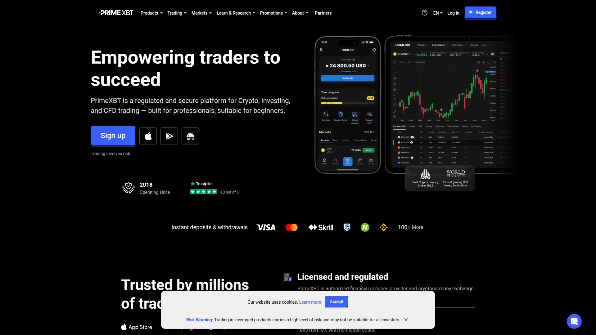

PrimeXBT has built its reputation on providing professional-grade leverage trading with some of the lowest fees in the industry. The platform caters to experienced traders seeking efficient execution and minimal cost overhead.

The exchange supports over 50 cryptocurrency pairs with emphasis on major assets and high-liquidity markets. Derivatives products include perpetual contracts, futures, and options with various leverage levels.

**Trading infrastructure:** Professional charting tools integrate technical indicators, drawing tools, and customizable layouts for market analysis. The platform delivers institutional-quality execution with minimal slippage on limit orders.

Risk management features help traders control exposure through stop-loss orders, take-profit targets, and position sizing calculators. The interface assumes familiarity with leverage trading concepts and derivative products.

Security measures include cold storage for majority of funds, two-factor authentication, and encryption protocols. The platform maintains stable operations during high-volatility periods.

PrimeXBT focuses exclusively on trading rather than additional services like staking or lending. This specialization allows optimization of the core trading experience and fee structures.

---

## **[Changelly](https://changelly.com)**

Instant cryptocurrency exchange service supporting 150+ digital assets with non-custodial swaps and competitive conversion rates.

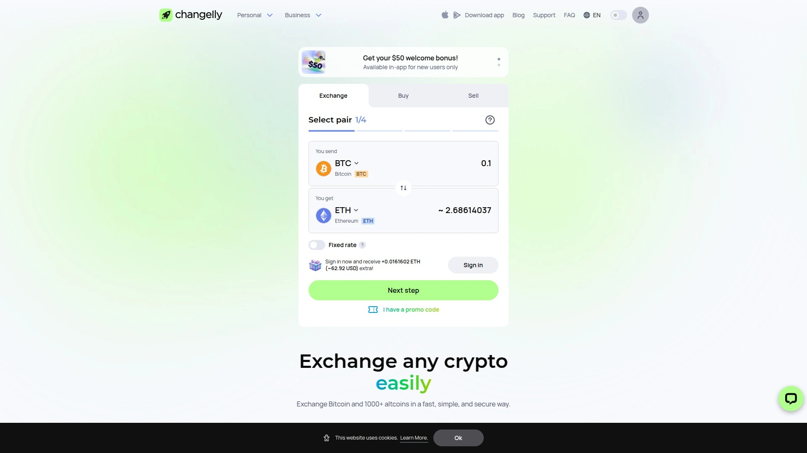

Changelly operates as an aggregator rather than traditional exchange, finding the best rates across multiple platforms for each swap. This approach often delivers better pricing than single-exchange rates.

The platform enables direct cryptocurrency-to-cryptocurrency exchanges without requiring account funding or order book trading. Users send one crypto and receive another directly at the displayed rate.

**Service model:** Changelly doesn't hold customer funds long-term, reducing custody risk compared to traditional exchanges. Swaps typically complete within minutes depending on blockchain confirmation times.

Fees vary depending on the specific exchange route and market conditions. The platform displays total costs upfront before users commit to transactions.

Over 150 cryptocurrencies are supported for instant swaps, covering major assets and numerous altcoins. The selection continues expanding as new cryptocurrencies gain traction.

The simple interface makes cryptocurrency swapping accessible for users uncomfortable with traditional exchange order books. No account registration is required for basic swaps, though KYC may apply for larger amounts.

---

## **[ChangeNOW](https://changenow.io)**

Non-custodial instant exchange supporting 1,500+ cryptocurrencies with no registration required and transparent fixed-rate swaps.

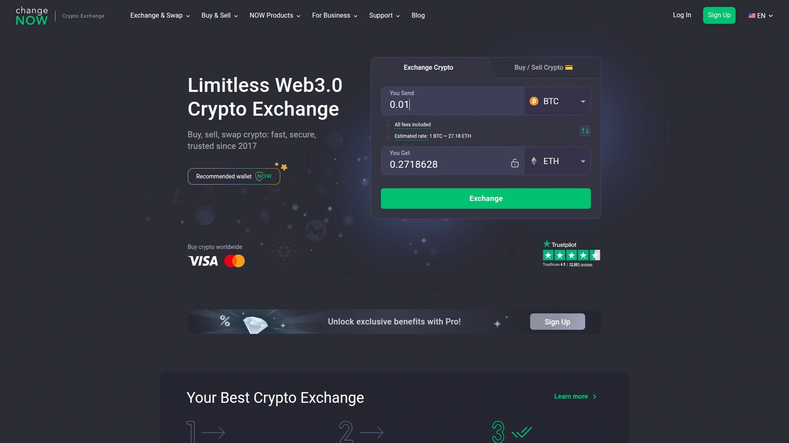

ChangeNOW distinguishes itself through truly non-custodial operations where user funds never enter exchange control. This approach eliminates custody risk while maintaining swap functionality.

The platform supports an exceptional 1,500+ cryptocurrencies, providing access to virtually any digital asset users might want to exchange. This breadth surpasses most traditional exchanges significantly.

**Privacy and accessibility:** No account registration is required for standard swaps, preserving user privacy while enabling instant exchanges. The platform calculates fixed rates upfront so users know exact amounts they'll receive.

Transaction fees differ based on specific swap routes and current market conditions. The platform maintains transparency by displaying all costs before users initiate exchanges.

The simple interface guides users through the swap process in just a few steps. Users select input and output currencies, enter amounts, provide receiving addresses, and send funds to complete exchanges.

ChangeNOW serves users who prioritize privacy, simplicity, and broad cryptocurrency access over advanced trading features. The non-custodial model appeals to those following self-custody principles.

***

## **[Paxful](https://paxful.com)**

Peer-to-peer cryptocurrency marketplace enabling direct trades with 300+ payment methods and escrow protection for secure transactions.

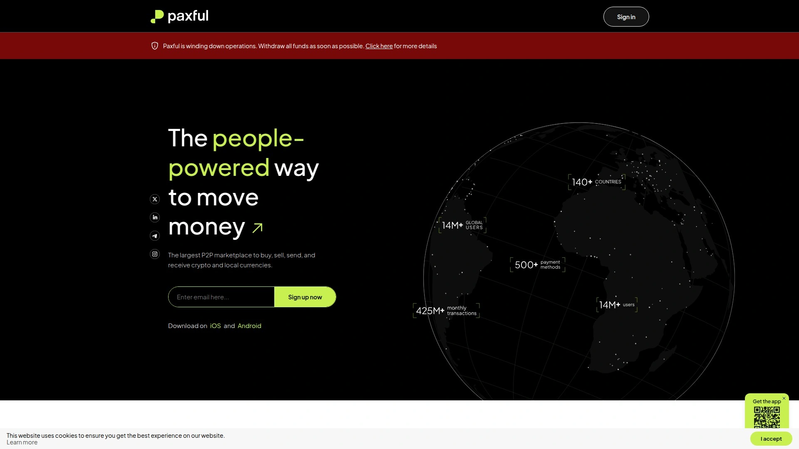

Paxful operates as a P2P marketplace connecting buyers and sellers directly rather than using order books. This model enables flexible payment methods including gift cards, bank transfers, and cash transactions.

The platform supports over 300 different payment methods, providing unprecedented flexibility for users in regions with limited banking access. This accessibility has made Paxful popular in developing markets.

**Escrow protection:** All trades use escrow services where cryptocurrency is held until both parties confirm transaction completion. This reduces counterparty risk compared to direct peer-to-peer trading.

Users can buy and sell Bitcoin, Ethereum, Tether, and other major cryptocurrencies through personalized trades. The marketplace model allows negotiation on prices and payment terms.

Verification requirements scale with transaction sizes, with smaller trades requiring minimal documentation. The platform implements identity verification and reputation systems to prevent fraud.

Trading fees vary based on whether users are buying or selling, with sellers typically paying platform fees. The peer-to-peer model often results in premiums above spot prices due to convenience and payment method risks.

---

## **[Hodl Hodl](https://hodlhodl.com)**

Decentralized P2P exchange with non-custodial multi-signature escrow, enabling direct cryptocurrency trades without platform control over funds.

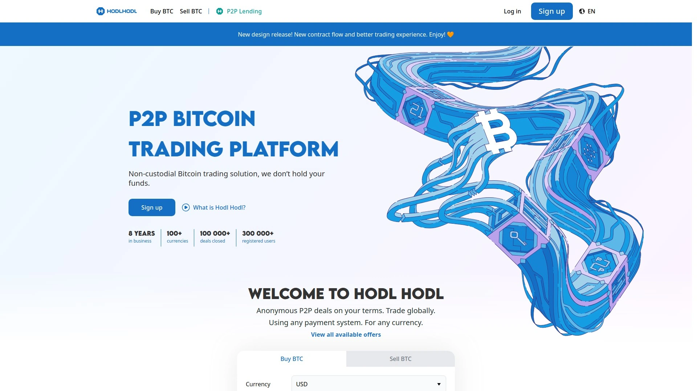

Hodl Hodl implements true non-custodial trading through multi-signature escrow contracts where the platform cannot access user funds. This architecture provides security without requiring trust in a central authority.

The peer-to-peer marketplace connects buyers and sellers for direct cryptocurrency trading with flexible payment terms. Users negotiate prices, payment methods, and trade conditions independently.

**Privacy and security:** No KYC requirements apply for basic trading, preserving user privacy while enabling market access. The multi-signature escrow provides protection against fraud without custody risks.

The platform supports Bitcoin and other major cryptocurrencies with emphasis on decentralized operations. Users maintain control of their private keys throughout the trading process.

Trading fees remain competitive with other P2P platforms while delivering enhanced security through the non-custodial architecture. The decentralized model appeals to users prioritizing self-sovereignty.

The interface assumes some cryptocurrency knowledge, with focus on experienced users who understand multi-signature wallets and self-custody principles. Educational resources help new users understand the platform's unique approach.

---

## **[Bisq](https://bisq.network)**

Fully decentralized exchange operating as desktop software with no company control, enabling censorship-resistant peer-to-peer trading.

Bisq represents the ultimate in decentralized cryptocurrency trading, operating as open-source desktop software rather than a centralized platform. No company or entity controls the network, making it resistant to shutdown or censorship.

The peer-to-peer network connects buyers and sellers directly through secure channels with no intermediary involvement. Users trade Bitcoin and other cryptocurrencies using various payment methods.

**Security model:** Multi-signature escrow and security deposits from both parties protect against fraud without custodial control. Arbitration processes resolve disputes when necessary.

No account registration or KYC applies, preserving complete privacy for users. The decentralized architecture ensures no central point of failure or data collection.

Users download and run Bisq software on their computers, connecting directly to the peer-to-peer network. This requirement creates a higher technical barrier than browser-based exchanges.

Trading fees go to contributors who provide liquidity and maintain network operations. The fully decentralized model appeals to users prioritizing privacy, censorship resistance, and self-sovereignty above convenience.

---

## **[Coincheck](https://coincheck.com)**

Japanese cryptocurrency exchange operating under strict domestic regulations with strong local market presence and yen trading pairs.

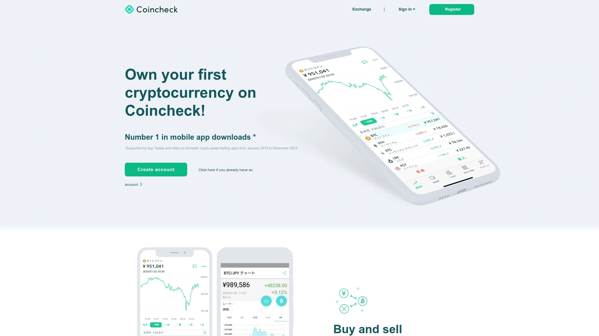

Coincheck serves the Japanese market with full regulatory compliance under the country's strict cryptocurrency exchange licensing framework. The platform has rebuilt its reputation following historical security incidents through enhanced protection measures.

The exchange provides access to major cryptocurrencies with deep liquidity in yen trading pairs. Japanese users benefit from localized customer support and banking integrations.

**Regulatory compliance:** Operating under Japanese Financial Services Agency oversight, Coincheck implements stringent security standards and reporting requirements. This regulatory framework provides consumer protections beyond many international exchanges.

The platform offers spot trading, cryptocurrency storage services, and payment functionality for Japanese merchants. Mobile applications deliver full trading capabilities optimized for domestic users.

Security measures include cold storage, multi-signature wallets, and regular third-party audits. The exchange maintains insurance coverage for customer assets.

Coincheck primarily serves Japanese residents with localized features and payment methods. International users may face restrictions or limited functionality depending on their location.

---

## **[Poloniex](https://poloniex.com)**

Veteran cryptocurrency exchange with extensive altcoin selection, margin trading capabilities, and established operational history since 2014.

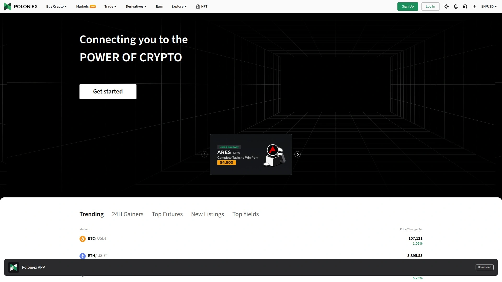

Founded in 2014, Poloniex has maintained its position as a significant platform in the cryptocurrency ecosystem. The exchange currently manages approximately $2 billion in assets across numerous trading pairs.

The platform provides access to major cryptocurrencies and extensive altcoin selections with various trading pairs. Margin trading enables leveraged positions for experienced traders seeking enhanced exposure.

**Trading features:** The exchange offers spot markets, margin trading, and lending markets where users can earn interest by providing funds to margin traders. Professional charting tools and technical indicators support analysis.

Fee structures reward higher trading volumes with decreasing rates as monthly volume increases. The platform maintains competitive pricing across its trading pairs.

Security implementations include cold storage for majority of funds, two-factor authentication, and withdrawal confirmation systems. The exchange has operated continuously through various market cycles.

Poloniex serves international users with appropriate compliance in supported jurisdictions. The platform continues evolving its offerings to meet changing market demands.

***

## **[Bitpanda](https://bitpanda.com)**

European neobroker democratizing investing with low fees, 24/7 trading, real-time settlement, and multi-asset capabilities beyond cryptocurrencies.

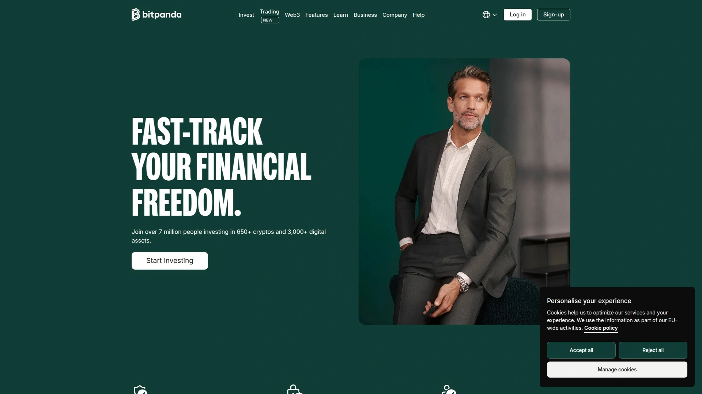

Bitpanda positions itself as a comprehensive investment platform serving European users with cryptocurrencies, stocks, ETFs, precious metals, and commodities. The neobroker approach simplifies investing across multiple asset classes.

**Trading infrastructure:** The platform operates 24/7 with real-time settlement, providing flexibility beyond traditional market hours. Low fees make frequent trading economically viable.

Users access over 230 cryptocurrencies alongside traditional assets, enabling diversified portfolio construction within a single interface. The platform emphasizes user empowerment to shape financial futures on their own terms.

European regulations govern Bitpanda's operations, providing consumer protections and regulatory oversight. The platform maintains appropriate licensing in its operating jurisdictions.

Security measures include cold storage, two-factor authentication, and regular audits. The exchange implements best practices for protecting user assets and personal information.

Educational resources help users understand different asset classes and develop investment strategies. The platform targets both beginners seeking accessible entry points and experienced investors wanting comprehensive tools.

---

## **[Bit2Me](https://bit2me.com)**

Prominent Spanish crypto broker established in 2014, offering 230+ cryptocurrencies with industry-leading customer service and European focus.

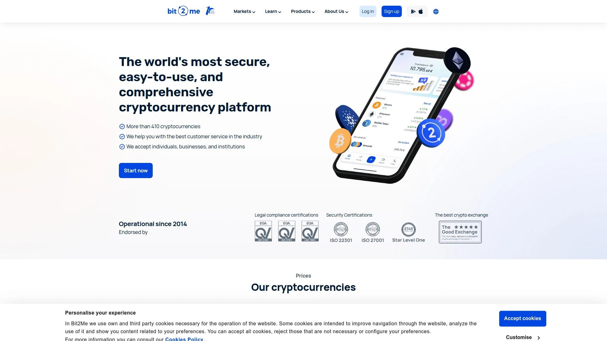

Bit2Me serves European markets with particular strength in Spanish-speaking regions. The platform has built its reputation on user-friendly design combined with comprehensive cryptocurrency selection.

Supporting over 230 cryptocurrencies, the exchange provides extensive altcoin access alongside major digital assets. This breadth appeals to users seeking diversified exposure beyond Bitcoin and Ethereum.

**Customer service distinction:** Bit2Me emphasizes industry-leading customer support with responsive, knowledgeable staff. Users rate the platform highly for ease of use and problem resolution.

The broker model simplifies cryptocurrency acquisition through straightforward buying and selling rather than complex order books. This approach benefits users who want simple access without trading complexity.

European regulatory compliance and licensing provide legal framework for operations. The platform implements KYC and AML procedures in accordance with regional requirements.

Security infrastructure includes cold storage, multi-factor authentication, and encryption protocols. The exchange maintains transparent operations with regular security updates.

---

## How do trading fees compare across major cryptocurrency exchanges?

Trading fees vary significantly based on order type, volume tiers, and platform business models. Kraken offers some of the lowest fees starting at 0.16% maker and 0.26% taker, decreasing to 0% for high-volume traders, while Coinbase charges 0.40%-0.60% on Advanced Trade and up to 4% on Simple Trade depending on payment methods. Volume-based discounts reward active traders across most platforms, with monthly trading amounts determining fee tiers.

Bybit implements innovative negative maker fees at -0.025%, actually paying liquidity providers while charging 0.075% for takers. PrimeXBT delivers ultra-low rates at 0.01% maker and 0.02% taker for derivatives. Exchange-specific tokens sometimes provide additional fee reductions when used for payment.

## What security measures should I look for in a cryptocurrency exchange?

Cold storage architecture represents the foundation of exchange security, with leading platforms storing 90-95% of customer funds offline in multi-signature wallets. Proof-of-reserves audits demonstrate that exchanges maintain full backing of customer deposits through transparent verification. Two-factor authentication, biometric login, hardware security modules, and withdrawal address whitelisting provide account-level protection.

Insurance coverage varies dramatically between platforms. Some exchanges maintain crime insurance for hot wallet breaches while others offer no coverage, with cryptocurrency holdings typically not FDIC-insured unlike fiat balances. Regulatory compliance under frameworks like New York's BitLicense or EU licensing requirements adds oversight layers that unregulated exchanges lack.

## Which platforms work best for beginners versus experienced traders?

Coinbase remains the gold standard for cryptocurrency beginners through its intuitive interface, extensive educational resources, and regulatory compliance. The platform simplifies first purchases while offering growth paths through Advanced Trade features. Crypto.com delivers excellent mobile experiences for users who prefer smartphone trading.

Experienced traders gravitate toward Kraken, Bitfinex, and OKX for advanced order types including stop-loss, trailing stops, margin trading, and futures contracts. These platforms provide professional-grade charting, API connectivity for algorithmic strategies, and the deepest liquidity pools. Lower fee structures at higher volumes make them cost-effective for active trading.

---

Selecting your primary cryptocurrency exchange platform fundamentally impacts your trading costs, asset access, and security outcomes throughout your digital currency journey. **[Coinbase](https://coinbase.com)** stands out for users prioritizing regulatory compliance, beginner accessibility, and mainstream adoption confidence with its 100+ million user base and transparent security practices. The platform balances ease of use for newcomers with sufficient advanced features for growing traders, making it the comprehensive choice for building long-term cryptocurrency positions.
